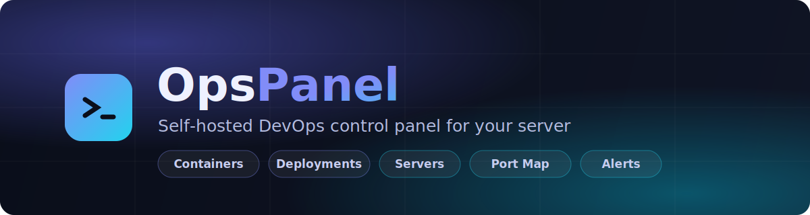

<p align="center">
  
</p>

<p align="center">
  
  
  
  
  
  
  
</p>

<p align="center">
  <b>One dashboard for your whole server.</b><br>
  Containers · deployments · remote-server SSH · port mapping · backups · alerting —<br>
  with role-based access, 2FA, and an append-only audit log.
</p>

---

> ⚠️ **This is a privileged tool.** It can run commands on the host and manage
> Docker. Treat it like a root shell exposed over HTTP — run it on a host you
> control, behind TLS, ideally on a private network/VPN. Read
> [SECURITY.md](SECURITY.md) before deploying.

**Honesty principle:** the panel never fabricates data. Unconfigured
integrations, unreachable services, and un-reverified items show honest
empty / stale / red states. If it hasn't been checked, it does not show green.

## Stack

Next.js 14 (App Router, TS) · Tailwind (dark-first, EN/FA + RTL) · Prisma 6 +
PostgreSQL · JWT auth (ADMIN > ENGINEER > REVIEWER > READONLY) · Redis ·
dockerode · simple-git · node-ssh.

## Requirements

- A **Linux host you control** with Docker — a real VPS or bare metal
  (DigitalOcean, Hetzner, Linode, bare EC2, …). It uses `nsenter` + a privileged
  container to operate on the host, so it **will not run on managed PaaS** that
  forbids privileged containers.
- Node 20+ (only if running outside Docker).
- Postgres + Redis (bundled in the compose files).

## Quick start (Docker)

```bash
git clone https://github.com/Parsa8304/opspanel.git
cd opspanel
cp .env.example .env

# Generate the required secrets and put them in .env:
openssl rand -hex 32   # → JWT_SECRET and PANEL_JWT_SECRET
openssl rand -hex 32   # → PANEL_MASTER_KEY
# also set PANEL_PG_PASSWORD

docker compose -f docker-compose.prod.yml up -d --build
```

The app fails closed without `JWT_SECRET` and `PANEL_MASTER_KEY` — this is
intentional. On first boot the seed creates an admin account and prints a
random password once (override with `ADMIN_EMAIL` / `ADMIN_PASSWORD`). The panel
is served via the bundled nginx on ports `8088` (→ HTTPS redirect) and `8443`.

### Local development

```bash
docker compose up -d            # postgres on :5544, redis on :6390
cp .env.example .env            # set JWT_SECRET + PANEL_MASTER_KEY
npm install
npx prisma db push
npm run seed
npm run dev
```

## Configuration

Most endpoints are configured in-app (the **Settings** page and per-section
editors), stored in the `Setting` table. Key environment variables (see
[.env.example](.env.example) for the full list):

| Variable | Purpose |
|---|---|
| `JWT_SECRET` | Signs sessions (≥32 chars, required in prod) |
| `PANEL_MASTER_KEY` | Encrypts secrets at rest (≥16 chars, required in prod) |
| `APP_NAME` | UI branding / TOTP issuer (default `OpsPanel`) |
| `INFRA_DEPLOY_DIR` | Host dir for Infra Deploy / Discovery (default `/opt/app`) |
| `PANEL_LOCAL_HOST` | Logical name for the local host in Port Map / Servers |

## Features

|  |  |  |
|---|---|---|
| 📊 **Overview** — readiness score, active alerts, live trend sparklines | 🐳 **Containers** — Docker stats, logs (SSE), exec, compose grouping | 🖥️ **Servers** — register remote hosts, run commands over SSH |
| 🌐 **Port Map** — real `ss`/`netstat`/Docker observation, conflict & exposure findings | 🚀 **Deploy / Versions** — git history, env matrix, blue-green / rolling / recreate, rollback | 🏗️ **Infra Deploy** — editable, config-driven deploy steps on the host |
| 🔀 **Migration** — host-to-host service/data migration via ansible-runner | 💾 **Backup & Restore** — schedules, discovered jobs, restore | 🔐 **Domains & SSL** — cert expiry & DNS checks |
| ⏰ **Cron Jobs** — host crontab management | ⚡ **Async Pipeline** — Redis/Celery queue depth, dead-letter, SSE stream | 🔔 **Alerts** — Telegram/webhook, rules, ack/snooze |
| 🔌 **Integrations** — health, test-connection, incidents | 🔎 **Discovery** — auto-detect services from Docker/compose | ✅ **Q/A & Tests** — JUnit ingest, flaky detection, coverage |
| 📈 **Code Benchmarks** — LOC/complexity/lint, API p50/95/99 | 💰 **Billing & Cost** — usage ingest, budgets, reconciliation | 🛡️ **Access & Audit** — roles, TOTP 2FA, append-only log |

## Tests

Integration tests run against real services (Docker, Postgres, Redis, git).

```bash
npm test                 # all suites (needs postgres + redis up)
npm run test:containers  # a single suite
```

## Contributing

Issues and PRs welcome. For security reports, please use a private GitHub
security advisory rather than a public issue (see [SECURITY.md](SECURITY.md)).

## License

[MIT](LICENSE)
